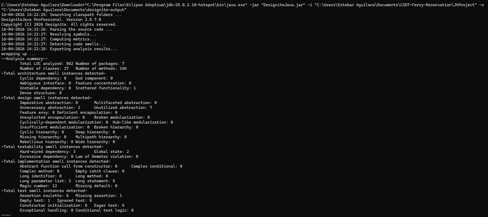

# Architectural Smells - Sistema de Reserva de Ferry

## Introducción

Para este análisis se utilizó Designite sobre el proyecto Java con Spring Boot para revisar la calidad arquitectónica del sistema. El objetivo fue identificar problemas de diseño que, aunque no siempre rompen el funcionamiento inmediato, sí pueden complicar la evolución del software con el tiempo.

## Evidencia del análisis

Figura 1. Captura del resumen de Designite utilizada como soporte de los resultados reportados en este documento.

---

## Scattered Functionality

**Descripción:**
Este smell aparece cuando una misma responsabilidad funcional queda repartida en varias partes del sistema, en lugar de estar centralizada en un módulo claro.

**Evidencia en el proyecto:**
Designite detectó **1 ocurrencia**.

**Problema:**
Cuando la funcionalidad está dispersa, es más difícil entender el flujo completo y hacer cambios sin olvidar algún punto del sistema.
En este proyecto se observa en AdminController y UserController, donde hay flujos similares como profileDisplay y carga de productos repartidos en ambos controladores.

**Impacto:**

* Mantenibilidad: aumenta el esfuerzo para localizar y modificar comportamiento relacionado.
* Escalabilidad: agregar nuevas capacidades del mismo dominio exige tocar varios puntos.
* Testabilidad: requiere más pruebas de integración para cubrir una misma funcionalidad distribuida.

**Recomendación:**
En Spring Boot conviene consolidar la lógica por caso de uso en servicios bien delimitados, reduciendo comportamiento duplicado o repartido entre controladores y capas auxiliares.

---

## Unutilized Abstraction

**Descripción:**
Este smell indica que existen abstracciones (por ejemplo, clases o interfaces) que fueron creadas pero no se usan realmente para aportar variación o reutilización.

**Evidencia en el proyecto:**
Designite detectó **7 ocurrencias**.

**Problema:**
Tener abstracciones sin uso real agrega complejidad accidental: hay más elementos que leer y mantener, pero sin un beneficio claro en diseño.
Un ejemplo concreto es CartProductRepository, que en esta revisión no se observa integrado en los flujos principales de AdminController, UserController o cartService.

**Impacto:**

* Mantenibilidad: el código se vuelve más difícil de navegar por capas que no aportan valor.
* Escalabilidad: se pierde claridad sobre cuáles puntos de extensión son verdaderamente útiles.
* Testabilidad: puede fragmentar las pruebas en componentes que no representan comportamiento relevante.

**Recomendación:**
Revisar interfaces y clases abstractas para decidir si deben eliminarse o usarse de forma consistente. Si no hay múltiples implementaciones previstas, en muchos casos es mejor simplificar.

---

## Unnecessary Abstraction

**Descripción:**
Se presenta cuando se introduce una abstracción que no es necesaria para el contexto actual del sistema.

**Evidencia en el proyecto:**
Designite detectó **2 ocurrencias**.

**Problema:**
Agregar niveles de abstracción sin necesidad incrementa la cantidad de código y dificulta la comprensión del comportamiento real.
También se nota la convivencia de capas con rol similar, como productDao y cartDao junto con CartProductRepository, sin una estrategia única de persistencia.

**Impacto:**

* Mantenibilidad: obliga a seguir más saltos entre clases para entender procesos simples.
* Escalabilidad: decisiones futuras pueden construirse sobre una base innecesariamente compleja.
* Testabilidad: aumenta el número de unidades a mockear o simular sin ganar cobertura funcional real.

**Recomendación:**
Aplicar el principio de simplicidad: mantener solo abstracciones justificadas por variación real o por una necesidad de desacoplamiento concreta en Spring.

---

## Hard-wired Dependency

**Descripción:**
Este smell ocurre cuando un componente depende de otro de forma rígida, con acoplamiento fuerte, dificultando reemplazo o configuración flexible.

**Evidencia en el proyecto:**
Designite detectó **3 ocurrencias**.

**Problema:**
Las dependencias cableadas de forma directa reducen la flexibilidad del sistema y hacen más costosos los cambios tecnológicos o de comportamiento.
Por ejemplo, en AdminController se usa DriverManager.getConnection("jdbc:mysql://localhost:3306/ecommjava","root","") de forma directa en lugar de delegar en servicios o repositorios.

**Impacto:**

* Mantenibilidad: pequeños cambios en una clase pueden forzar cambios en varias dependientes.
* Escalabilidad: limita la evolución hacia nuevas implementaciones o integraciones.
* Testabilidad: complica pruebas aisladas, porque cuesta sustituir dependencias por dobles de prueba.

**Recomendación:**
Fortalecer inyección de dependencias y programación contra interfaces para reducir acoplamiento directo. En Spring Boot, priorizar componentes inyectados y configurables sobre instanciación rígida.

---

## Global State

**Descripción:**
Este smell aparece cuando existe estado compartido globalmente, accesible desde varios componentes, generando efectos colaterales.

**Evidencia en el proyecto:**
Designite detectó **2 ocurrencias**.

**Problema:**
El estado global dificulta predecir el comportamiento del sistema porque distintos módulos pueden modificar datos compartidos en momentos distintos.
En este caso se evidencia por el uso repetido de SecurityContextHolder en AdminController y UserController para obtener y actualizar información de sesión.

**Impacto:**

* Mantenibilidad: eleva la complejidad al depurar errores por cambios de estado no controlados.
* Escalabilidad: en escenarios concurrentes puede producir inconsistencias.
* Testabilidad: vuelve frágiles las pruebas por dependencias implícitas entre casos.

**Recomendación:**
Reducir estado compartido y preferir manejo de estado por alcance de componente o por transacción. En Spring, favorecer beans stateless para lógica de negocio.

---

## Conclusión

Con base en los resultados de Designite, la arquitectura no se ve crítica, pero sí presenta señales claras de deuda de diseño que pueden crecer con el tiempo. Las mejoras principales pasan por simplificar abstracciones innecesarias, disminuir acoplamientos rígidos y controlar mejor el estado compartido. Actualmente el sistema es mantenible, pero su mantenibilidad podría deteriorarse rápido si estos smells no se corrigen en iteraciones futuras.
