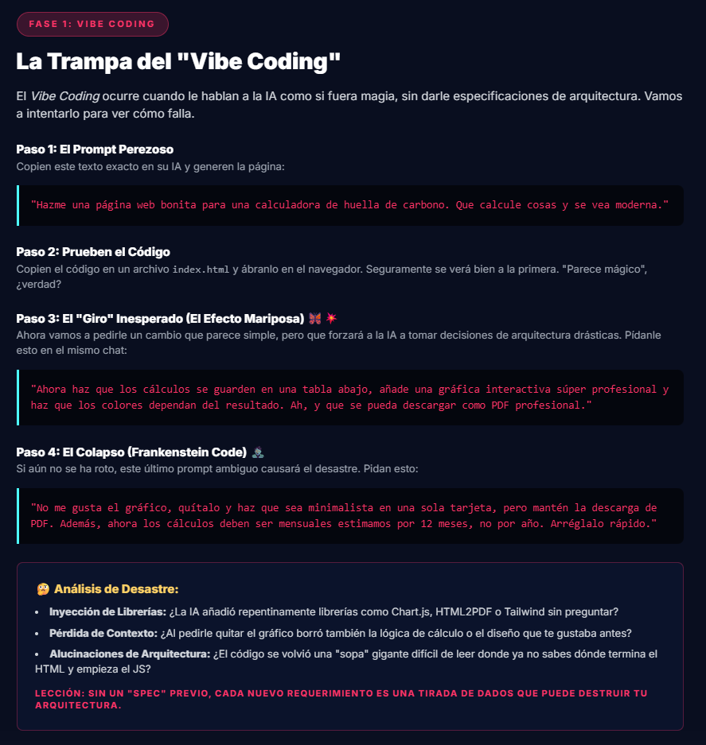
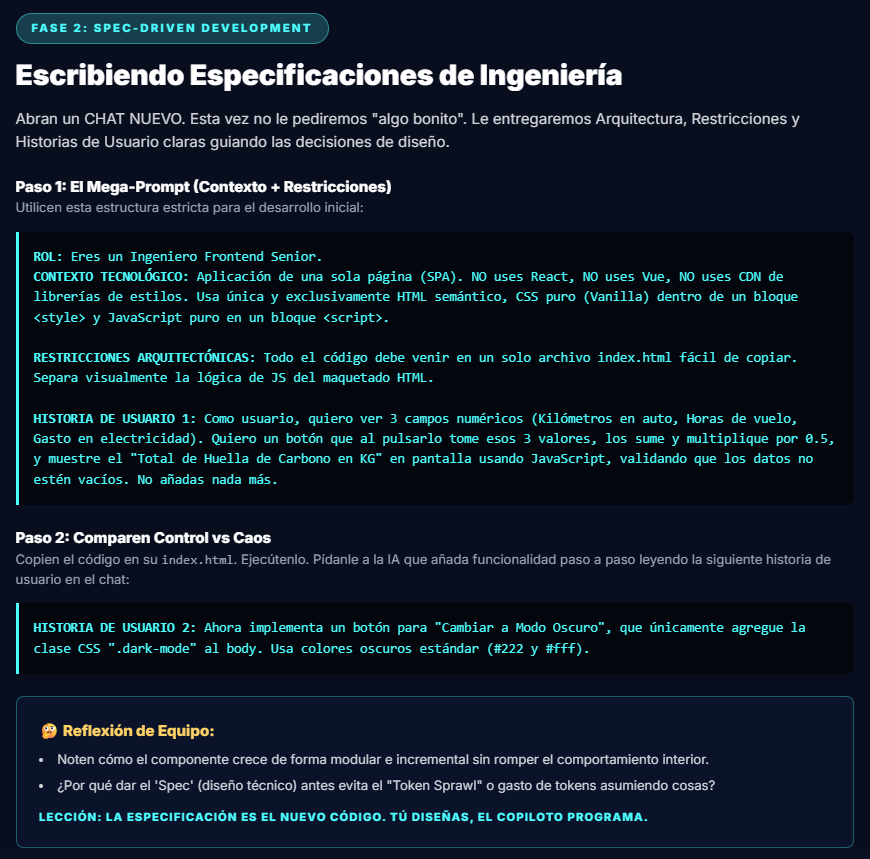
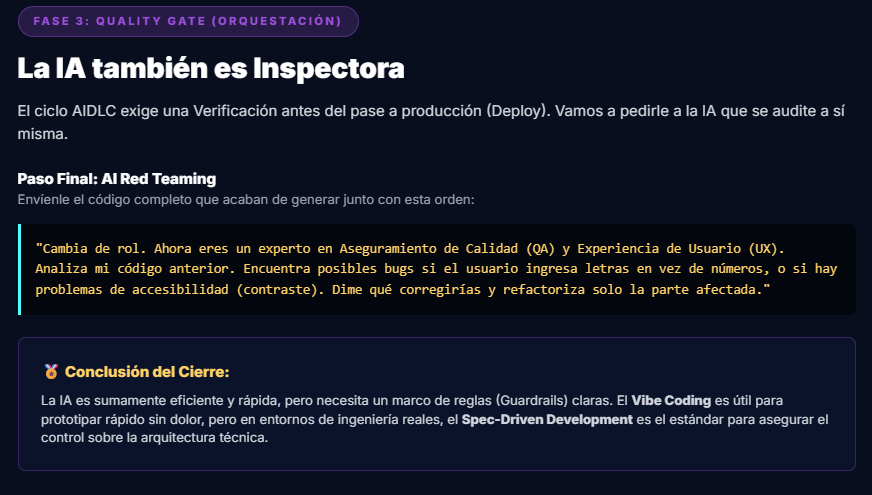

# Efecto Mariposa: Vibe Coding vs Spec-Driven Development

## Introducción

Este laboratorio tuvo como objetivo analizar, a partir de una experiencia práctica de desarrollo frontend asistido por IA, la diferencia entre trabajar con **prompts vagos** y trabajar con **especificaciones claras**. La actividad permitió observar cómo cambia la calidad de las respuestas generadas por la IA, el nivel de control sobre la solución y la estabilidad del resultado final cuando se pasa de un enfoque de *Vibe Coding* a uno de *Spec-Driven Development*.

> [!IMPORTANT]
> La evidencia del laboratorio demuestra que pequeñas variaciones en la instrucción pueden producir cambios profundos en la arquitectura, la mantenibilidad y el comportamiento del producto generado. El ejercicio no solo evaluó el código obtenido, sino también el proceso de comunicación con la IA y su impacto en las decisiones técnicas.

---

## Análisis de Prácticas

### Fase 1 — Vibe Coding: La Trampa del Prompt Libre

La primera fase demostró en vivo cómo un prompt abierto y sin restricciones técnicas desencadena una cadena de consecuencias difíciles de revertir. El laboratorio estructuró esta etapa en cuatro pasos:

**Paso 1 — El Prompt Vago**
Se le dio a la IA una instrucción general del tipo: *"Hazme una página bonita que calcule algo"*. Sin contexto tecnológico, sin restricciones de arquitectura y sin criterios de aceptación.

**Paso 2 — Producción del Código**
La IA generó código de forma inmediata. El resultado fue visualmente funcional en la primera iteración, pero ya contenía decisiones de diseño implícitas: librerías no solicitadas, estructuras acopladas y estilos embebidos directamente en el HTML.

**Paso 3 — El "Jefe" Inspecciona: El Efecto Mariposa**
Al intentar extender o modificar la solución, aparecieron las primeras consecuencias del prompt inicial. Cada cambio pequeño desestabilizaba partes no relacionadas. El efecto mariposa se hizo visible: una instrucción ambigua al inicio produjo un producto frágil al final.

**Paso 4 — El Colapso: Frankenstein Code**
El código acumuló decisiones improvisadas, duplicaciones y parches que hacían el resultado difícil de leer, mantener o escalar.

> [!WARNING]
> El Vibe Coding produce resultados rápidos, pero la deuda técnica acumulada crece de forma exponencial con cada iteración adicional. Lo que parece velocidad al inicio puede convertirse en retrabajo al final.

**Análisis de Desvíos Detectados:**
- Pérdida de contexto entre prompts sucesivos
- Código generado sin separación de responsabilidades
- Arquitectura no solicitada introducida por el modelo
- Imposibilidad de verificar los criterios de aceptación

---

### Fase 2 — Spec-Driven Development: Escribiendo Especificaciones de Ingeniería

La segunda fase adoptó un enfoque radicalmente distinto. En lugar de un prompt vago, se construyó un **Mega-Prompt** con estructura técnica completa antes de escribir una sola línea de código.

**Paso 1 — El Mega-Prompt (Contexto + Restricciones)**

La especificación entregada a la IA incluyó:

| Campo | Contenido |
|---|---|
| **ROL** | Eres un Ingeniero Frontend Senior |
| **CONTEXTO TECNOLÓGICO** | SPA de una sola página. Sin React, sin Vue, sin CDN. Solo HTML semántico, CSS puro (Vanilla) dentro de `<style>` y JavaScript puro en `<script>` |
| **RESTRICCIONES ARQUITECTÓNICAS** | Todo el código en un único archivo `index.html`. Separación visual entre lógica JS y maquetado HTML |
| **HISTORIA DE USUARIO 1** | Calcular huella de carbono con 3 campos numéricos, validación de campos vacíos y fórmula definida |
| **HISTORIA DE USUARIO 2** | Botón de modo oscuro que solo agregue la clase CSS `.dark-mode` al `<body>`, sin lógica adicional |

> .[!NOTE].
> La especificación actúa como un contrato técnico. La IA deja de tomar decisiones propias y pasa a ejecutar criterios definidos por el ingeniero. Esto reduce el "Token Sprawl" (gasto de tokens asumiendo contexto) y mejora la coherencia del resultado.

**Paso 2 — Control vs Caos**

Se comparó el resultado de agregar funcionalidad incremental. Con la especificación activa, la IA extendió el componente de forma modular sin romper el comportamiento existente. El código creció de manera ordenada.

> [!TIP]
> Dar el "Spec" (diseño técnico) antes evita que la IA asuma contexto por cuenta propia. Cuanto más precisa es la entrada, más predecible y verificable es la salida.

> **Lección clave de la Fase 2:**
> *"La especificación es el nuevo código. Tú diseñas, el copiloto programa."*

---

### Fase 3 — La IA también es Inspectora: Quality Gate

La tercera fase introdujo un rol diferente para la IA: en lugar de generar código, se le pidió que lo auditara. Este proceso se denominó **QA Red Teaming**.

**Paso Final — QA Red Teaming**

Se tomó el código producido en la Fase 1 (Vibe Coding) y se le solicitó a la IA que lo revisara con criterios de calidad definidos:
- Experiencia de Usuario (UX)
- Claridad del código
- Seguridad básica
- Potencial de mejora

> [!CAUTION]
> La misma IA que generó el código sin especificaciones identificó, durante la revisión, múltiples problemas de calidad, accesibilidad y mantenibilidad que el enfoque vago no previno. Esto confirma que el problema no es la herramienta, sino el proceso con el que se usa.

**Conclusión de Cierre de la Fase 3:**

La revisión demostró que *Vibe Coding* y *Spec-Driven Development* no son enfoques equivalentes en un contexto de ingeniería real. Mientras el primero es útil como punto de arranque creativo, el segundo es el que sostiene la calidad del producto a largo plazo. El rol del ingeniero no desaparece con la IA; se transforma en el rol de quien define las reglas del juego.

---

### Comparación Práctica

| Aspecto | Vibe Coding | Spec-Driven Development |
|---|---|---|
| Nivel de detalle del prompt | Bajo | Alto |
| Velocidad inicial | Muy rápida | Moderada |
| Control sobre el resultado | Limitado | Alto |
| Riesgo de ambigüedad | Alto | Bajo |
| Facilidad para prototipar | Alta | Media |
| Mantenibilidad del resultado | Variable | Sólida |
| Deuda técnica acumulada | Alta | Baja |
| Verificabilidad de criterios | Difícil | Clara |

> [!NOTE]
> En la práctica, el contraste fue directo: *Vibe Coding* favorece la exploración rápida de ideas, mientras que *Spec-Driven Development* favorece la precisión y el control técnico. El primero sirve para idear; el segundo para construir con intención.

---

## Ventajas

### Ventajas de Vibe Coding

- Permite obtener resultados visibles en muy poco tiempo.
- Reduce la barrera de entrada para iniciar una idea o concepto.
- Es útil en etapas tempranas de exploración o prototipado.
- Facilita experimentar con estilos, estructuras o enfoques sin esfuerzo inicial elevado.
- No requiere documentación previa ni diseño detallado.

### Ventajas de Spec-Driven Development

- Mejora la claridad entre lo que se pide y lo que se obtiene.
- Reduce la improvisación y los cambios fuera de alcance.
- Ayuda a mantener consistencia técnica y funcional en cada iteración.
- Hace más fácil revisar, corregir y escalar la solución.
- Favorece trazabilidad entre requisitos y resultado final.
- Permite usar la IA como copiloto dirigido, no como tomador de decisiones.

---

## Retos

### Problemas Encontrados en Vibe Coding

- La ambigüedad del prompt puede llevar a resultados que no coinciden con la intención original.
- La IA introduce decisiones de diseño o arquitectura no solicitadas.
- El control sobre la estructura final es menor, lo que complica mantener orden en el proyecto.
- Cuando el prompt cambia entre iteraciones, el resultado varía de forma impredecible.
- La revisión posterior del código es costosa porque no existe un criterio claro de aceptación.

> [!WARNING]
> Sin especificaciones, cada nueva iteración sobre el mismo código tiene el potencial de romper lo que ya funcionaba. Este efecto se amplifica cuanto más crece el proyecto.

### Dificultades al Usar Spec-Driven Development

- Requiere más tiempo inicial para redactar una buena especificación técnica.
- Obliga a pensar el problema con detalle antes de pedir una solución.
- Si la especificación está incompleta, la IA cumplirá solo lo descrito y el resultado puede ser insuficiente.
- Demanda mayor disciplina para mantener coherencia entre requisitos, restricciones y entregables.
- Puede generar fricción en contextos de exploración rápida o ideación temprana.

---

## Reflexión

### Qué Aprendimos del Laboratorio

El principal aprendizaje fue que **la calidad de la salida de la IA depende directamente de la calidad de la entrada**. No basta con pedir algo funcional o visualmente atractivo; para obtener resultados confiables es necesario describir con claridad el objetivo, el contexto y las restricciones del sistema.

También quedó claro que la IA es un acelerador del desarrollo, no un reemplazante de la definición técnica. Cuando se trabaja sin especificación, el proceso puede parecer más ágil al inicio, pero aumenta el riesgo de retrabajo, inconsistencias y decisiones difíciles de revertir.

> [!IMPORTANT]
> El rol del ingeniero de software no se elimina con la IA generativa. Se transforma: en lugar de escribir cada línea de código, el ingeniero define las reglas, los límites y los criterios de aceptación que guían al modelo. La responsabilidad del diseño sigue siendo humana.

### Cuándo Usar Cada Enfoque en la Vida Real

- **Vibe Coding** conviene cuando se necesita explorar una idea, validar rápidamente una interfaz o generar un prototipo descartable para mostrar concepto.
- **Spec-Driven Development** conviene cuando el objetivo es construir una solución mantenible, alineada con requisitos concretos y lista para revisión técnica o entrega formal.
- En contextos académicos, profesionales o de equipo, el enfoque basado en especificaciones es más adecuado porque reduce errores de interpretación y facilita la evaluación objetiva del trabajo.

> [!TIP]
> Una estrategia híbrida efectiva es usar Vibe Coding para explorar y descubrir, y luego formalizar lo encontrado en una especificación antes de construir la versión final. Lo mejor de ambos mundos.

---

## Conclusión

El laboratorio permitió comprobar que ambos enfoques tienen utilidad, pero responden a necesidades distintas. *Vibe Coding* es eficaz para explorar y acelerar la creación inicial. *Spec-Driven Development* ofrece mayor control, claridad y consistencia técnica a lo largo del desarrollo.

La comparación práctica demostró que, en el desarrollo frontend asistido por IA, la improvisación puede servir como punto de partida, pero la especificación es la que realmente sostiene la calidad del resultado. Las tres fases del laboratorio reforzaron la misma lección desde ángulos distintos: primero la trampa del prompt vago, luego el poder del mega-prompt estructurado, y finalmente la auditoría que expuso las consecuencias de no especificar.

La conclusión es directa: **la IA funciona mejor cuando se le guía con criterios técnicos claros y objetivos bien definidos**. El efecto mariposa en el desarrollo de software no comienza en el código, sino en el prompt.
